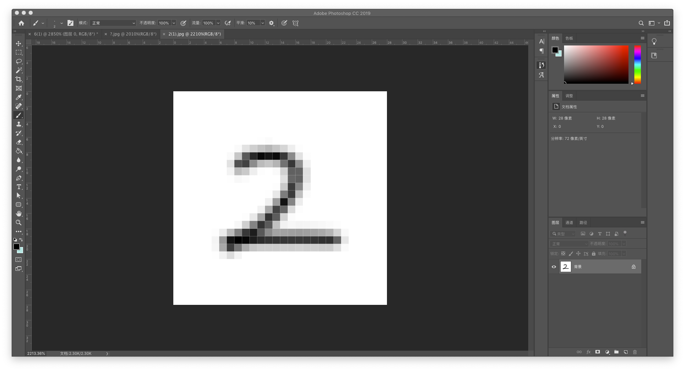
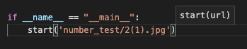

# handwriting_number

It's a handwritten number recognition tool based on convolutional neural network.

Based on tensorflow.

### You can write a number by Photoshop in 28*28 panel.

like this



And then, modify the code under ```if __name__ == '__main__':``` in start.py, make the String in the function ```start()``` point to your digital image, like this



Run it! get surprised.

.png)

.png)

.png)
